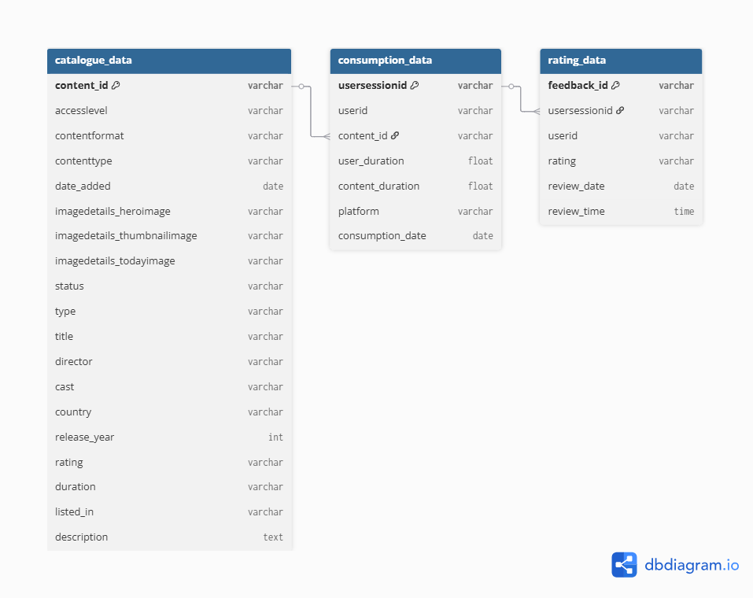

#  **Notflix Analytics – Content Performance & User Engagement Dashboard**

### An end-to-end analytics project built using **SQL Server (T-SQL)** and **Power BI**, analyzing streaming behavior, content performance, and audience feedback for a fictional OTT platform.  
This project integrates completion rates, ratings, and viewership metrics to deliver actionable insights and recommendations for content curation, promotion, and catalog optimization.

>Transforming streaming data into actionable insights that help Notflix understand what to promote, what to monitor, and what to retire.  

---

## **Features**

🧠 **SQL Server (T-SQL)** — Used to design analytical queries calculating completion rates, average ratings, view counts, and data-driven content classification (Promote / Monitor / Relegate).  
📊 **Power BI Desktop** — Built a 6-page interactive dashboard visualizing engagement, ratings, content distribution, and actionable recommendations.  
💾 **Data Modeling** — Structured relational joins between catalogue, consumption, and ratings datasets for accurate insights.  
📈 **Excel** — Utilized for initial data validation and quick checks before SQL transformation.  
⚡ **Multi-Page Interactive Report** — Developed a complete visual analytics experience covering executive summary, engagement, and performance recommendations.  

---

## **Introduction**

Notflix is a leading global **streaming and entertainment platform**, offering a wide range of movies, TV shows, and documentaries across multiple genres. The company’s catalogue spans over a thousand titles and operates in several international markets, including North America, Europe, and Asia-Pacific. As part of its continuous improvement strategy, Notflix collects **detailed viewing, rating, and consumption data** to better understand audience behavior. This analysis was conducted to help the **Content Strategy and Analytics Division** evaluate title performance, identify underperforming content, and make data-backed recommendations for catalog management and promotional campaigns.

---

##  **Business Objective**

The primary goal of this project is to help **Notflix** make informed, data-driven decisions about its vast content catalog and audience engagement strategy.  
By leveraging SQL and Power BI, this project aims to:

- Analyze content performance based on **completion rate**, **average rating**, and **view count**.  
- Identify **top-performing titles** for promotion and **low-performing titles** for relegation or removal.  
- Understand **user engagement patterns** across devices, regions, and time periods.  
- Evaluate **genre-level trends** to identify audience preferences and optimize content investments.  
- Develop an automated **content recommendation logic** (Promote / Monitor / Relegate) using SQL for scalable decision-making.  
- Visualize actionable KPIs through an interactive Power BI dashboard to support the **Content Strategy & Operations** teams.  

---

##  **Data Dictionary**

The analysis is based on three core datasets — **Catalogue**, **Consumption**, and **Ratings** — modeled using key relationships for performance insights.  
The full data dictionary describes each table, field, and relationship in detail.

 [View Full Data Dictionary →](data_dictionary.md)

---

## 🧠 **Analytical Approach**

The project followed a structured SQL-to-Power BI pipeline to analyze over 1.6 million data records across multiple datasets.

### 1. **Data Modeling (SQL Server)**
- Imported and cleaned raw data from three datasets:
  - `catalogue_data` (content metadata)
  - `consumption_data` (watch duration and user sessions)
  - `rating_data` (user feedback)
- Established primary relationships:
  - `catalogue.content_id = consumption.content_id`
  - `consumption.usersessionid = rating.usersessionid`
- Filtered out inactive or non-live content and normalized key fields for consistent joins.  

### 2. **Data Analysis & Transformation (SQL Server)**
- Created **CTE-based analytical queries** to compute:
  - Completion Rate = `(Total User Duration / Total Content Duration) * 100`
  - Average Rating (mapped from qualitative scores “Awesome” → 5 to “Terrible” → 1)
  - View Counts (total number of sessions per content)
  - Recency (based on `date_added` difference from reference date)
- Integrated all metrics to assign **action recommendations** using rule-based classification:
  - **Promote:** High rating (≥4), high completion (≥50%), consistent view count.  
  - **Monitor:** Moderate performance.  
  - **Relegate:** Low view count (<1000), low rating (≤3), poor completion (<50%).  

### 3. **Visualization & Dashboarding (Power BI)**
- Imported final SQL results into **Power BI** for dynamic visualization and storytelling.  
- Built a **6-page interactive dashboard** featuring:
  1. Title Page  
  2. Executive Overview  
  3. Catalogue Insights  
  4. Consumption & Engagement  
  5. Ratings & Feedback  
  6. Actionable Insights  
- Designed intuitive visuals — KPI cards, heatmaps, line charts, and category filters — to explore engagement patterns and title-level performance.  
- Summarized the entire content portfolio lifecycle from **catalog addition → user interaction → data-backed content decisions**.

---

##  **Key Insights & Business Impact**

### **Executive Overview**
- Notflix’s catalogue includes **1,342 titles**, generating over **68 million watch hours** with an average **completion rate of 77.9%**, showing strong user engagement overall.  
- Genres like **International Movies**, **Dramas**, and **Comedies** dominate viewership, contributing to more than **60% of total hours watched**.  
- Engagement peaks during **June–July**, while **December** sees a visible drop, reflecting seasonal viewing trends.  
- The majority of engagement comes from **Paid subscribers**, as only **~150 free titles** exist and they contribute marginally to total watch time.  

---

### **Catalogue Insights**
- Content expansion surged after **2018**, with **2021 adding 1,800+ titles**, marking Notflix’s biggest content rollout.  
- **83% of titles are TV-MA rated**, limiting appeal to younger and family audiences.  
- **May** records the most new content additions, suggesting structured or batch release cycles.  
- While Notflix is globally available, **North America and Europe** lead in viewership, while **Asia-Pacific markets** remain under-engaged.  

---

### **Consumption & Engagement**
- **Android devices** account for over **60% of total viewing time**, confirming it as the dominant access medium.  
- The **average watch session lasts 75 minutes**, nearly double the typical OTT engagement benchmark — a clear indicator of binge behavior.  
- Interestingly, **Fridays, Saturdays, and Sundays have the lowest view hours**, while **Tuesdays peak** — an unexpected trend suggesting weekday preference or higher weekend competition from other platforms.  
- **Independent Movies** and **Documentaries** show low completion rates, implying slower pacing or limited audience appeal.  

---

### **Ratings & Feedback**
- With over **2 million user reviews**, the **average rating stands at 3.87**, reflecting generally positive audience sentiment.  
- Roughly **25% of titles are rated below 3.5**, showing a long tail of underperforming content.  
- Ratings have gradually declined since **2021**, likely due to rapid catalog expansion and quality inconsistency.  
- *Chhota Bheem*, *Hard Kill*, and *Seven Souls in the Sun* rank among the top-rated titles, while *Radium Girls* and *Heroes: Silence* fall at the bottom.  

---

### **Actionable Insights / Content Strategy**
- SQL-driven classification grouped **386 live titles** into:
  - **Promote:** 129 (33.4%)  
  - **Monitor:** 230 (59.6%)  
  - **Relegate:** 27 (7%)  
- *Promote* titles (high completion + strong ratings) are ideal for homepage placement or marketing campaigns.  
- *Monitor* titles should be tracked for changes in engagement, while *Relegate* titles are potential candidates for removal or repositioning.  
- User funnel analysis shows a **>20% post-view interaction rate**, indicating high engagement among active users.  
- Regional patterns and device data highlight opportunities for targeted promotions and UI optimization.  

---

### **Strategic Takeaways**
- **Too many new titles post-2018** diluted attention — Notflix should focus on quality curation over quantity.  
- **Marketing efforts** should be reallocated to high-performing “Promote” titles for better ROI.  
- **iOS and Web platforms** require optimization to reduce dependency on Android users.  
- Address **low weekend engagement** with time-limited releases or exclusive premieres.  
- Introduce more **family-friendly and PG-rated** content to broaden audience reach.  
- Leverage the **SQL-based Promote/Monitor/Relegate framework** to automate catalog performance reviews.

##  Dashboard Preview

### Entity Relationship Diagram
The following diagram shows the relationships between the three main tables:

### Executive Overview  

### Catalogue Insights  

### Consumption & Engagement  

### Ratings & Feedback  

### Actionable Insights  

---

##  **Business Recommendations**

- **Rebalance content portfolio:** Shift focus from quantity to quality — recent years saw aggressive content expansion, but engagement didn’t scale proportionally. Prioritize curation, not just acquisition.  
- **Promote high-performing titles:** Feature “Promote” category content on the homepage and recommendation carousels to maximize watch time and retention.  
- **Re-engage weak-performing titles:** For “Monitor” titles, experiment with improved thumbnails, localized dubbing, or limited ad campaigns to test engagement before considering removal.  
- **Phase out low-impact content:** “Relegate” titles (7%) can be rotated out, bundled, or replaced with niche, regional, or seasonal content to maintain freshness.  
- **Optimize viewing experience:** Strengthen iOS and web app performance to reduce Android dependency and balance platform usage.  
- **Capitalize on weekday peaks:** Introduce midweek release strategies or “Tuesday Specials” since viewing is strongest on Tuesdays, leveraging audience momentum.  
- **Boost weekend engagement:** Launch time-limited premieres or weekend-exclusive releases to counter lower watch hours on Fridays through Sundays.  
- **Invest in genre diversification:** Add family-friendly, PG-rated, and localized content to broaden audience demographics beyond mature viewers.  
- **Expand regional growth:** Localize content for Asia-Pacific markets and strengthen distribution partnerships to increase engagement in underperforming regions.  

---

## 🧭 **How to Use**

Follow these steps to explore the analysis and dashboards end-to-end:

1. **Clone the Repository**
2. **Explore the SQL Analysis**
   - Navigate to the [`/sql`](sql) folder.  
   - Run `Notflix Analysis.sql` in **SQL Server Management Studio (SSMS)**.  
   - The script creates analytical views and classifies each title as *Promote*, *Monitor*, or *Relegate*.  
3. **Review the Data Dictionary**
   - Open the [data_dictionary.md](data_dictionary.md) file to understand the schema and relationships between `catalogue_data`, `consumption_data`, and `rating_data`.
4. **View Sample Outputs**
   - Check the dashboard-ready tables generated from SQL output before visualization.
5. **Open the Power BI Dashboard**
   - Navigate to the **Notflix Dashboard.pdf** for a static overview, or open **Notflix Dashboard.pbix** in Power BI Desktop to explore the fully interactive report.  
  6. **Review the Visuals**
   - Key screenshots of each page are also available in the [`/images`](images) folder for quick reference.

##  Contact  

    

